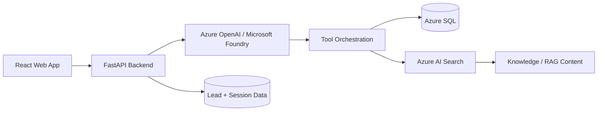

# Aqarmind Backend

Public portfolio implementation of the backend architecture behind **Aqarmind**, an AI-powered real estate advisory platform.

> This repository is intentionally sanitized for public access. It contains no production credentials, private endpoints, customer data, or proprietary datasets.

## What Aqarmind demonstrates

- Conversational AI application architecture
- Retrieval-Augmented Generation (RAG)
- Azure AI Search with vector / hybrid retrieval
- LLM tool / function calling
- Structured property search using Azure SQL
- Deterministic mortgage calculations
- Lead capture workflows
- Session-level usage controls and guardrails
- FastAPI REST services
- Azure-oriented configuration and deployment patterns

## Architecture



## Technology stack

**AI & Retrieval**
- Azure OpenAI / Microsoft Foundry model endpoints
- Azure AI Search
- RAG
- Embeddings and vector retrieval
- Hybrid retrieval and semantic ranking
- Tool / function calling

**Backend**
- Python
- FastAPI
- Pydantic
- REST APIs
- Azure SQL / ODBC

**Cloud & Engineering**
- Azure App Service
- Azure Key Vault / managed identity ready design
- Environment-based configuration
- GitHub Actions CI
- Application-level usage controls

## Main API capabilities

| Endpoint | Purpose |
|---|---|
| `GET /health` | Service health check |
| `GET /config-check` | Safe configuration readiness check |
| `GET /properties` | Retrieve structured property data |
| `POST /search-properties` | Search properties using structured filters |
| `POST /mortgage` | Deterministic mortgage estimate |
| `POST /knowledge-context` | Retrieve RAG context from Azure AI Search |
| `POST /chat` | Conversational orchestration entry point |
| `POST /leads` | Capture qualified lead information |

## Repository structure

```text
aqarmind-backend/
├── app/
│   ├── api/             # FastAPI routes
│   ├── core/            # Configuration and guardrails
│   ├── models/          # Request/response schemas
│   ├── services/        # AI, Search, SQL and domain services
│   ├── tools/           # LLM-callable business tools
│   └── main.py
├── docs/
│   └── architecture.md
├── tests/
├── .env.example
├── .gitignore
├── requirements.txt
└── SECURITY.md
```

## Local setup

```bash
python -m venv .venv
```

Windows:

```powershell
.\.venv\Scripts\Activate.ps1
```

macOS/Linux:

```bash
source .venv/bin/activate
```

Install dependencies:

```bash
pip install -r requirements.txt
```

Create a local environment file:

```bash
cp .env.example .env
```

Then supply your own development resource values in `.env`.

Run locally:

```bash
uvicorn app.main:app --reload
```

Open Swagger UI:

```text
http://127.0.0.1:8000/docs
```

## Public-repository security

This repository follows a simple rule: **configuration names may be public; credential values must never be public.**

The following are intentionally excluded by `.gitignore`:

- `.env` files
- API keys
- database passwords
- private keys / certificates
- local virtual environments
- IDE metadata
- logs and exports
- customer or production datasets

Use `.env.example` only as a template. For production deployments, prefer **managed identities + Azure Key Vault** rather than long-lived credentials where supported.

## Related project

- Live product: https://www.aqarmind.com/
- Frontend repository: https://github.com/mohammedatiq99-cell/aqarmind-frontend

## Portfolio note

The public repository focuses on architecture and engineering patterns. Production configuration, sensitive infrastructure values, business data, internal prompts, and private operational details are intentionally omitted.
